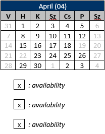

# Calendar Table Add In

An Outlook Add In that inserts a calendar into the mail. The calendar is basically a table that holds the current month's workday and holiday information.

Looks something like this:

Currently only supports hungarian holidays. If you want to use it replace all 'YOUR_API_KEY_GOES_HERE' occurances with your api key. For that I've made a shell script called 'insert_api_key_example' that replaces all of these dummy keys, whith the parameter you pass it to.
Usage: `sh ./insert_api_key_example.sh <your-api-key>`
