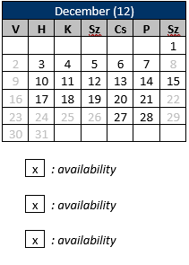

# CalendarTableAddIn

An Outlook Add In that inserts a calendar into the body of a mail. The calendar is basically a table that holds the current month's workday and holiday information.

Looks something like this:

Currently only supports hungarian holidays. If you want to use it replace all 'YOUR_API_KEY_GOES_HERE' occurances with your api key.
